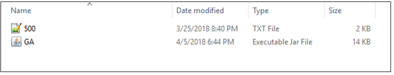
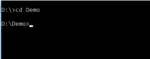

# AlphaGeneticAlgorithmProject
Grouping Genetic Algorithm created to test alpha male parent selection

## Program DEMO in demo folder

Located within the project is a folder called Demo which has a GA.jar alongside a txt file that contains 500 "items" called 500.txt  
This data set and jar file is used to demo the genetic algorithm.

The instructions to use the demo is as follows:

1. Open command prompt (cmd.exe) and navigate to the Demo folder.  

2. Next run GA.jar file with the following command: JAVA -jar GA.jar  
3. Now follow the instructions on screen. Once you enter the parent selection type the program will run. The settings shown are the recommended settings for the packaged txt file.
